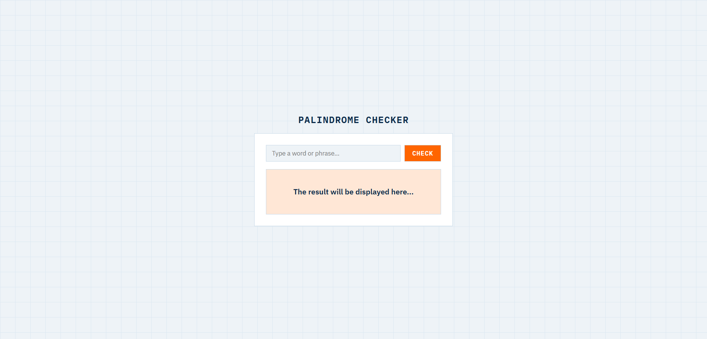

# Palindrome Checker

Checks whether a word or phrase reads the same forwards and backwards, ignoring case, punctuation, and spacing.

**Live demo:** [hunafazaky.github.io/palindrome-checker](https://hunafazaky.github.io/palindrome-checker)

## Features

- Instant palindrome check on click or Enter
- Ignores case, spaces, and punctuation

## Run Locally

Just open `index.html` in your browser — no install, no build step.

## License

MIT
